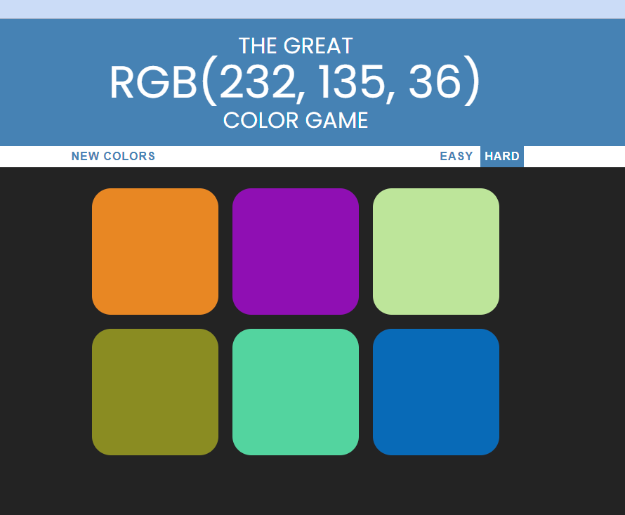
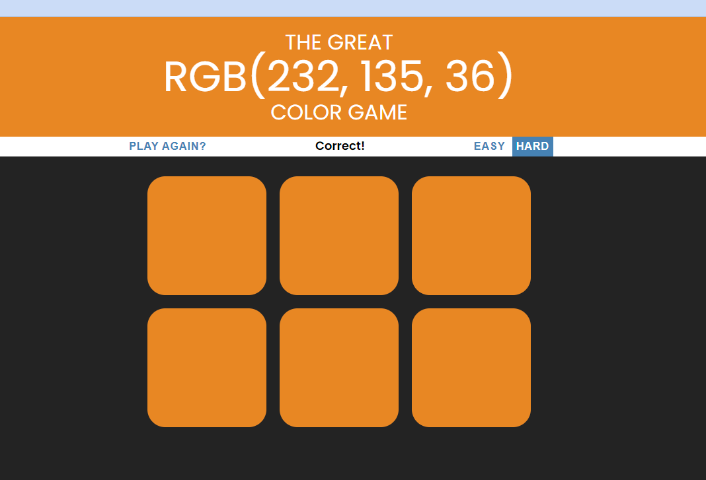

# Color RGB game

Simple RGB color game is a web application written in pure JavaScript, HTML and CSS. The aim of the game is to select the correct square that matches the displayed RGB color code. The game has two levels of difficulty: a basic level with three squares to choose from and an advanced level with six squares to choose from.

## Table of Contents
* [Technologies Used](#technologies-used)
* [Features](#features)
* [Screenshots](#screenshots)
* [Project Status](#project-status)
* [Contact](#contact)

## Technologies Used
- JavaScript - ES12
- Html 5
- Css3

## Features

### Game features
- Difficulty level selection: The player can choose whether he wants to play on basic or advanced level.
- Selecting a square: The player can click on the selected square to select it.
- Level won or lost information: Information about whether the player won or lost the round.
- "New Game" button: Allows you to start the game at any time.

## Screenshots

### Game menu

### Game win

## Project Status
Project is: **Finished**.

## Contact
Created by [@Igossx](https://www.github.com/igossx) - feel free to contact me!

 
